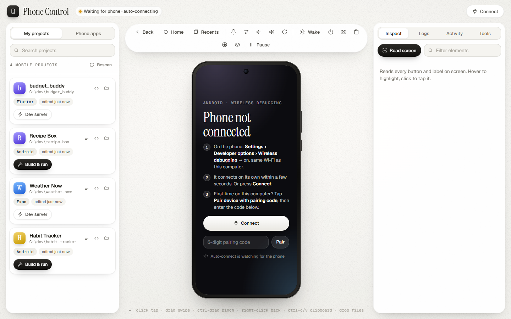

# phonectl

[](https://discord.gg/zEB4VjmfSb)

Control your real Android phone from your computer — from the terminal, from a browser
dashboard, or by letting an AI coding agent (Claude Code, Codex, Cursor…) drive it.

- **See and drive the phone live** in a browser tab (60fps, mouse = touch, keyboard = typing).
- **Let an agent build a mobile app and check its own work** on the real device: it takes a
  screenshot, reads the screen as text, taps buttons by their label, installs builds and reads
  crash logs — instead of asking you to click around and describe what happened.
- **No cable needed.** Pair once over Wi-Fi with a 6-digit code.
- **No dependencies** beyond Node, `adb` and `scrcpy`. No app is installed on the phone
  (only scrcpy's server and a tiny icon reader, in its temp folder). Nothing leaves your network.

Works on Windows, macOS and Linux.



## Install

1. **Node 20+**, **adb** and **scrcpy (tested with 4.1)**:

   | | |
   |---|---|
   | Windows | `winget install OpenJS.NodeJS.LTS Google.PlatformTools Genymobile.scrcpy` |
   | macOS | `brew install node android-platform-tools scrcpy` |
   | Linux | `sudo apt install nodejs adb scrcpy` (or [scrcpy's install guide](https://github.com/Genymobile/scrcpy#get-the-app)) |

2. **phonectl:**

   ```bash
   git clone https://github.com/blixvip/phonectl.git
   cd phonectl
   npm link          # puts the `phonectl` command on your PATH
   phonectl doctor   # checks everything is found
   ```

## Connect your phone

1. On the phone, turn on **Developer options**: Settings → About phone → Software information →
   tap **Build number** 7 times.
2. Settings → Developer options → turn on **Wireless debugging** (phone and computer on the
   same Wi-Fi).
3. Tap **Pair device with pairing code**, keep that dialog open, and run:

   ```bash
   phonectl pair 123456      # the 6-digit code on the phone
   ```

That's a one-time step. After a phone restart, just turn Wireless debugging on again and run
`phonectl connect` (the dashboard reconnects by itself).

Prefer a cable? Turn on **USB debugging** instead, plug in, and accept the prompt on the phone.

## The dashboard

```bash
phonectl dash             # opens http://127.0.0.1:4360
```

- Live screen you can click, scroll, drag and type into (Ctrl+V pastes your clipboard to the phone)
- App list with real icons — launch, stop, restart, grant permissions, clear data
- Your Android / Expo / Flutter / Capacitor projects with one-click **Build & run**
- Logs, live crash watcher, screen recording, screenshots, element inspector
- Drop an `.apk` to install it, or any other file to copy it to the phone's Downloads
- Activity feed of everything an agent did on the phone

The dashboard only listens on `127.0.0.1` and rejects requests from other websites, so
nothing else on your network or in your browser can drive the phone.

## The command line

```text
phonectl status                 device, android version, screen size, focused app
phonectl shot [file.png]        screenshot -> PNG file path
phonectl ui [query]             read the screen as text: coords, labels, tappables
phonectl tap "Sign in"          tap the element whose label matches (or: tap <x> <y>)
phonectl swipe [x1 y1 x2 y2 ms] swipe (no args = scroll up)
phonectl text "hello"           type into the focused field
phonectl key back|home|enter    press a key
phonectl apps [query]           installed apps
phonectl launch|stop <pkg>      start / force-stop an app
phonectl install <file.apk>     install or update an APK
phonectl open <url>             open a URL or deep link
phonectl logs [pkg] [--all]     recent warnings/errors
phonectl crash                  the crash buffer
phonectl record [sec]           record the screen to mp4
phonectl reverse [port]         let the phone reach a dev server on this computer (default 8081)
phonectl pair | connect | discover | find | wifi | wake | doctor
```

Add `--json` to any command for machine-readable output, `--serial X` to pick a device.

## Using it with an AI agent

Open your app's folder in your agent and tell it about phonectl — or point it at
[AGENTS.md](AGENTS.md), which explains the build → screenshot → check loop. Claude Code picks
it up automatically when run inside this folder (`CLAUDE.md` imports `AGENTS.md`).

A typical loop the agent runs after each change:

```bash
phonectl reverse 8081            # Expo / React Native dev server
phonectl shot                    # look at the result
phonectl ui                      # find the button
phonectl tap "Continue"
phonectl logs com.example.app    # anything break?
```

## Settings

Optional `~/.phonectl/config.json`:

```json
{
  "projectRoots": ["~/code", "~/work/apps"],
  "phoneIp": "192.168.1.42"
}
```

- `projectRoots` — folders the dashboard scans for your app projects (default: `~/code`,
  `~/projects`, `~/dev`, `~/src`, `~/AndroidStudioProjects`).
- `phoneIp` — used by `phonectl find` when Wi-Fi discovery doesn't work on your network.

Environment variables: `PHONECTL_SERIAL` (device to use), `PHONECTL_PROJECT_ROOTS`,
`SCRCPY_SERVER_PATH` (if your scrcpy install keeps `scrcpy-server` somewhere unusual).

## Troubleshooting

Run `phonectl doctor`. The usual answers:

- **"none connected"** — Wireless debugging turns itself off after a restart or Wi-Fi change.
  Turn it back on; `phonectl connect`.
- **Pairing fails** — the pairing dialog has to stay open, and its port is different from the
  one on the main Wireless debugging screen. `phonectl pair <code>` finds the right one.
- **Live view is a slideshow** — scrcpy wasn't found, so it fell back to screenshots. Install
  scrcpy (tested with 4.1) and check `phonectl doctor`.

## Community

💬 [Join the Discord](https://discord.gg/zEB4VjmfSb) for questions, help, feedback, and updates.

## License

MIT
